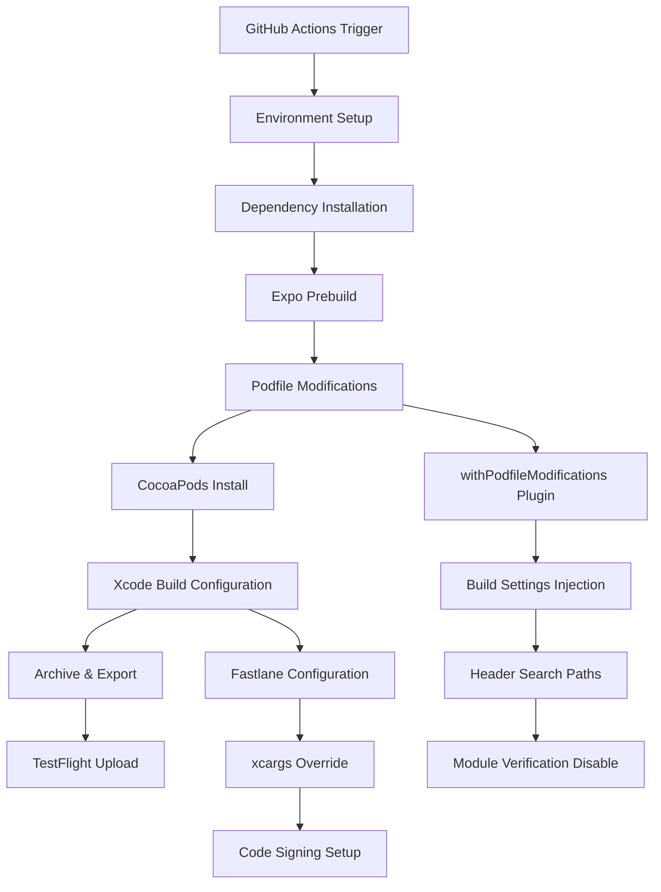
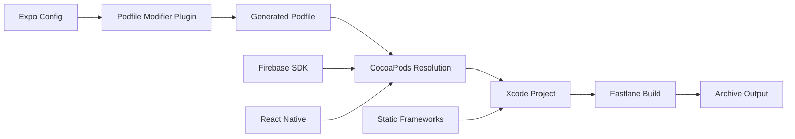

# Design Document: iOS Build Fix for Xcode 16.1 Compatibility

## Overview

This design addresses the critical iOS build failures occurring in GitHub Actions when using Xcode 16.1 with React Native Expo applications that integrate Firebase. The core issue stems from Xcode 16.1's stricter module precompilation system conflicting with React Native Firebase's header structure and static framework requirements.

The solution implements a comprehensive build configuration strategy that:
1. Disables problematic Xcode 16.1 module verification features
2. Configures static frameworks with proper header search paths
3. Applies Firebase-specific preprocessor definitions
4. Implements robust error handling and retry mechanisms
5. Ensures consistent CI/CD pipeline execution

## Architecture

### Build Pipeline Architecture



### Component Interaction Model



## Components and Interfaces

### 1. Podfile Modification Plugin (`withPodfileModifications.ts`)

**Purpose**: Automatically inject Xcode 16.1 compatibility settings into the generated Podfile during Expo prebuild.

**Key Responsibilities**:
- Disable module verification (`CLANG_ENABLE_MODULE_VERIFIER=NO`)
- Configure static framework compatibility settings
- Set deployment target to iOS 15.1+
- Inject Firebase-specific header search paths
- Apply preprocessor definitions for symbol conflict resolution

**Interface**:
```typescript
interface PodfileModificationConfig {
  platformProjectRoot: string;
  buildSettings: XcodeBuildSettings;
  headerSearchPaths: string[];
  preprocessorDefinitions: string[];
}

interface XcodeBuildSettings {
  CLANG_ENABLE_MODULE_VERIFIER: 'NO';
  CLANG_ENABLE_EXPLICIT_MODULES: 'NO';
  SWIFT_ENABLE_EXPLICIT_MODULES: 'NO';
  CLANG_ALLOW_NON_MODULAR_INCLUDES_IN_FRAMEWORK_MODULES: 'YES';
  USE_HEADERMAP: 'NO';
  SWIFT_VERSION: '5.0';
  IPHONEOS_DEPLOYMENT_TARGET: '15.1';
}
```

### 2. GitHub Actions Workflow (`qa-release.yml`)

**Purpose**: Orchestrate the complete iOS build and deployment process with proper error handling and artifact management.

**Key Components**:
- Environment setup with Xcode 16.1
- Dependency caching and installation
- Build artifact cleanup and management
- Keychain management for code signing
- Retry logic for TestFlight uploads

**Interface**:
```yaml
workflow_inputs:
  xcode_version: "16.1"
  node_version: "18"
  ruby_version: "3.2"
  
workflow_outputs:
  ipa_artifact: "ios-release-ipa"
  build_logs: "fastlane-gym-logs"
  github_release: "qa-v{run_number}"
```

### 3. Fastlane Configuration (`Fastfile`)

**Purpose**: Handle iOS-specific build operations including code signing, archiving, and TestFlight deployment.

**Key Features**:
- App Store Connect API integration
- Automatic build number management
- Retry logic for duplicate build handling
- Comprehensive build settings override via xcargs

**Interface**:
```ruby
lane_parameters:
  workspace: "ios/smbmobile.xcworkspace"
  scheme: "smbmobile"
  configuration: "Release"
  export_method: "app-store"
  
build_settings:
  xcargs: "COMPREHENSIVE_XCODE_16_COMPATIBILITY_FLAGS"
  export_options: "APP_STORE_PROVISIONING_PROFILES"
```

### 4. Expo Configuration (`app.config.ts`)

**Purpose**: Configure Expo build properties and plugin integration for iOS compatibility.

**Key Settings**:
- Static frameworks via `expo-build-properties`
- iOS deployment target specification
- Firebase plugin integration
- Custom plugin registration

**Interface**:
```typescript
interface ExpoConfig {
  plugins: [
    ['expo-build-properties', {
      ios: {
        useFrameworks: 'static',
        deploymentTarget: '15.1'
      }
    }],
    ['./plugins/withPodfileModifications.ts']
  ];
}
```

## Data Models

### Build Configuration Model

```typescript
interface BuildConfiguration {
  xcodeVersion: '16.1';
  deploymentTarget: '15.1';
  frameworkLinkage: 'static';
  moduleVerification: false;
  swiftVersion: '5.0';
  
  firebaseSettings: {
    useStaticFrameworks: true;
    headerSearchPaths: string[];
    preprocessorDefinitions: string[];
  };
  
  codeSigningSettings: {
    teamId: string;
    provisioningProfile: string;
    certificateType: 'iPhone Distribution';
  };
}
```

### Error Handling Model

```typescript
interface BuildError {
  type: 'compilation' | 'codesigning' | 'upload' | 'dependency';
  severity: 'fatal' | 'warning' | 'recoverable';
  message: string;
  suggestedAction: string;
  retryable: boolean;
}

interface RetryConfiguration {
  maxAttempts: 3;
  backoffStrategy: 'exponential';
  retryableErrors: BuildError['type'][];
}
```

### Artifact Management Model

```typescript
interface BuildArtifacts {
  ipa: {
    path: 'ios/build/smbmobile.ipa';
    retentionDays: 30;
  };
  logs: {
    gymLogs: '~/Library/Logs/gym/';
    xcodeLogs: 'ios/build/logs/';
  };
  metadata: {
    buildNumber: number;
    version: string;
    commitSha: string;
    buildTime: Date;
  };
}
```

## Correctness Properties

*A property is a characteristic or behavior that should hold true across all valid executions of a system-essentially, a formal statement about what the system should do. Properties serve as the bridge between human-readable specifications and machine-verifiable correctness guarantees.*

Based on the prework analysis, I've identified several key properties that can be combined for comprehensive testing while eliminating redundancy:

**Property Reflection:**
- Properties 1.1-1.5 (Xcode 16.1 compatibility) can be combined into a comprehensive build configuration property
- Properties 2.1-2.3, 2.5 (Firebase integration) can be consolidated into Firebase build compatibility
- Properties 3.1-3.5 (CI/CD reliability) can be combined into pipeline execution validation
- Properties 4.1-4.5 (build configuration) can be merged into configuration management validation
- Properties 6.1-6.5 (error handling) can be consolidated into error reporting validation
- Properties 7.1-7.4 (performance optimization) can be combined into build optimization validation
- Properties 8.1-8.5 (validation and testing) can be merged into build validation checks

### Property 1: Xcode 16.1 Build Configuration Compatibility
*For any* iOS build configuration, when using Xcode 16.1, the build system should generate configurations that disable module verification, set compatible Swift versions, configure static frameworks, and include proper header search paths for Firebase modules.
**Validates: Requirements 1.1, 1.2, 1.3, 1.5**

### Property 2: Firebase Static Framework Integration
*For any* build that includes Firebase SDK, the build system should configure static framework linking, include Firebase-specific preprocessor definitions, resolve all Firebase module headers, and preserve Firebase configuration files in the correct locations.
**Validates: Requirements 2.1, 2.2, 2.3, 2.5**

### Property 3: CI Pipeline Execution Reliability
*For any* GitHub Actions build execution, the pipeline should clean previous artifacts, apply Podfile modifications, implement retry logic for transient failures, capture detailed error logs, and complete the full workflow including IPA upload.
**Validates: Requirements 3.1, 3.2, 3.3, 3.4, 3.5**

### Property 4: Build Configuration Management
*For any* Expo prebuild and Fastlane execution, the build system should inject required build settings into the Podfile, pass necessary xcargs to Fastlane, ensure iOS 15.1+ deployment targets, configure correct code signing, and prioritize compatibility settings over defaults.
**Validates: Requirements 4.1, 4.2, 4.3, 4.4, 4.5**

### Property 5: Dependency Version Compatibility
*For any* dependency resolution process, the build system should use Xcode 16.1 compatible React Native Firebase versions, handle CocoaPods version conflicts gracefully, and preserve custom build configurations during updates.
**Validates: Requirements 5.1, 5.3, 5.5**

### Property 6: Archive Step Success
*For any* iOS archive operation, the build process should complete successfully without PrecompileModule errors when using Xcode 16.1 with Firebase and static frameworks.
**Validates: Requirements 1.4**

### Property 7: Comprehensive Error Handling
*For any* build failure scenario, the build system should provide detailed error messages with file and line information, automatically handle duplicate build errors with retry logic, provide clear authentication error messages, capture CocoaPods error logs, and preserve debugging information.
**Validates: Requirements 6.1, 6.2, 6.3, 6.4, 6.5**

### Property 8: Build Optimization and Performance
*For any* build execution, the build system should minimize unnecessary artifact cleaning, enable CocoaPods caching, use parallel compilation settings, and preserve reusable compilation artifacts.
**Validates: Requirements 7.1, 7.2, 7.3, 7.4**

### Property 9: Build Validation and Quality Assurance
*For any* completed build, the build system should validate that all required build settings are applied, verify Firebase configuration files are embedded in the IPA, validate code signing compatibility, run basic IPA validation checks, and confirm successful TestFlight upload.
**Validates: Requirements 8.1, 8.2, 8.3, 8.4, 8.5**

## Error Handling

### Build Failure Recovery Strategy

The system implements a multi-layered error handling approach:

1. **Compilation Error Recovery**
   - Automatic detection of Xcode 16.1 module compilation issues
   - Fallback to alternative build settings when module verification fails
   - Clear error reporting with specific file and line information

2. **Dependency Resolution Failures**
   - CocoaPods conflict resolution with version pinning
   - Automatic cache clearing and retry for transient network issues
   - Fallback to alternative Firebase SDK versions if compatibility issues arise

3. **Code Signing and Deployment Errors**
   - Automatic keychain management and certificate validation
   - Retry logic for TestFlight upload failures with exponential backoff
   - Build number auto-increment for duplicate build conflicts

4. **CI/CD Pipeline Resilience**
   - Comprehensive artifact cleanup to prevent cache corruption
   - Build log preservation for debugging failed builds
   - Graceful degradation when optional optimization features fail

### Error Classification and Response

```typescript
interface ErrorHandlingStrategy {
  compilationErrors: {
    moduleVerificationFailure: 'disable_module_verification';
    headerNotFound: 'add_header_search_paths';
    swiftVersionConflict: 'set_compatible_swift_version';
  };
  
  deploymentErrors: {
    duplicateBuild: 'increment_build_number_and_retry';
    keychainAccess: 'reinitialize_keychain_with_clear_error';
    uploadTimeout: 'retry_with_exponential_backoff';
  };
  
  dependencyErrors: {
    podInstallFailure: 'clean_and_retry_with_repo_update';
    versionConflict: 'pin_compatible_versions';
    cacheCorruption: 'clear_cache_and_reinstall';
  };
}
```

## Testing Strategy

### Dual Testing Approach

The testing strategy combines unit testing for specific scenarios with property-based testing for comprehensive validation:

**Unit Testing Focus:**
- Specific Xcode 16.1 compatibility scenarios
- Firebase integration edge cases
- Code signing configuration validation
- Error handling for known failure modes
- CI/CD pipeline step validation

**Property-Based Testing Focus:**
- Build configuration generation across different project setups
- Dependency resolution with various version combinations
- Error recovery mechanisms with simulated failures
- Performance optimization under different build conditions
- End-to-end pipeline execution with randomized inputs

### Property-Based Test Configuration

- **Testing Framework**: Use `fast-check` for TypeScript/JavaScript components and `XCTest` with randomized inputs for iOS-specific validation
- **Test Iterations**: Minimum 100 iterations per property test to ensure comprehensive coverage
- **Test Environment**: GitHub Actions with Xcode 16.1 simulator for realistic testing conditions

### Test Implementation Requirements

Each correctness property must be implemented as a property-based test with the following configuration:

1. **Property 1 Test**: Generate various iOS project configurations and verify Xcode 16.1 compatibility settings are applied
   - **Tag**: Feature: ios-build-fix, Property 1: Xcode 16.1 Build Configuration Compatibility

2. **Property 2 Test**: Test Firebase integration across different static framework configurations
   - **Tag**: Feature: ios-build-fix, Property 2: Firebase Static Framework Integration

3. **Property 3 Test**: Simulate CI pipeline execution with various failure scenarios and verify recovery
   - **Tag**: Feature: ios-build-fix, Property 3: CI Pipeline Execution Reliability

4. **Property 4 Test**: Validate build configuration management across different Expo and Fastlane setups
   - **Tag**: Feature: ios-build-fix, Property 4: Build Configuration Management

5. **Property 5 Test**: Test dependency compatibility across different version combinations
   - **Tag**: Feature: ios-build-fix, Property 5: Dependency Version Compatibility

6. **Property 6 Test**: Verify archive step success across different project configurations
   - **Tag**: Feature: ios-build-fix, Property 6: Archive Step Success

7. **Property 7 Test**: Test error handling mechanisms with simulated failure conditions
   - **Tag**: Feature: ios-build-fix, Property 7: Comprehensive Error Handling

8. **Property 8 Test**: Validate build optimization features across different build scenarios
   - **Tag**: Feature: ios-build-fix, Property 8: Build Optimization and Performance

9. **Property 9 Test**: Test build validation and quality assurance checks
   - **Tag**: Feature: ios-build-fix, Property 9: Build Validation and Quality Assurance

### Integration Testing Strategy

Beyond property-based tests, the system requires integration testing that validates:
- Complete GitHub Actions workflow execution
- Real TestFlight deployment scenarios
- Actual Xcode 16.1 compilation with Firebase
- End-to-end build artifact validation

This comprehensive testing approach ensures both individual component correctness and system-wide reliability.

Now I need to use the prework tool to analyze the acceptance criteria before writing the correctness properties:

<function_calls>
<invoke name="prework">
<parameter name="featureName">ios-build-fix